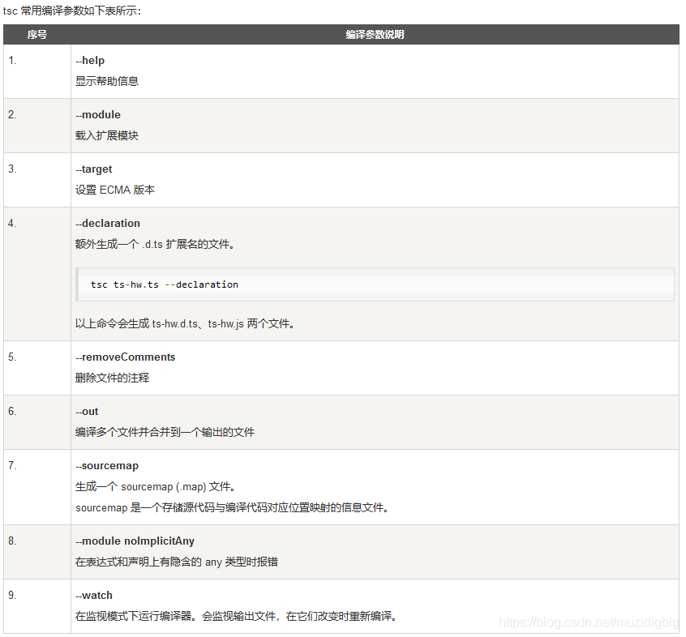

# typescript-learn
typescript学习代码笔记

## Issues
使用的时候遇到任何问题或有好的建议，请点击进入[issue](https://github.com/agile-contrib/typescript-learn/issues)，欢迎参与维护！

## How to use?

运行下面的命令，就可以把```src/index.ts```里面的```TypeScript```代码变成原来的```JavaScript```代码：

```
npm run build
```

## tsc命令



开源协议
---------------------------------------
[MIT](https://github.com/agile-contrib/typescript-learn/blob/master/LICENSE)

Copyright (c) 2021 [hai2007](https://hai2007.gitee.io/sweethome/) 走一步，再走一步。
